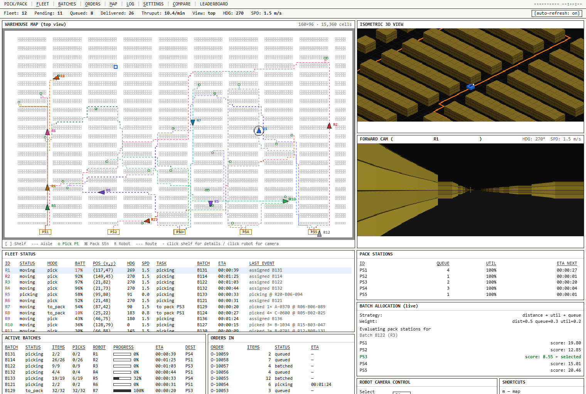
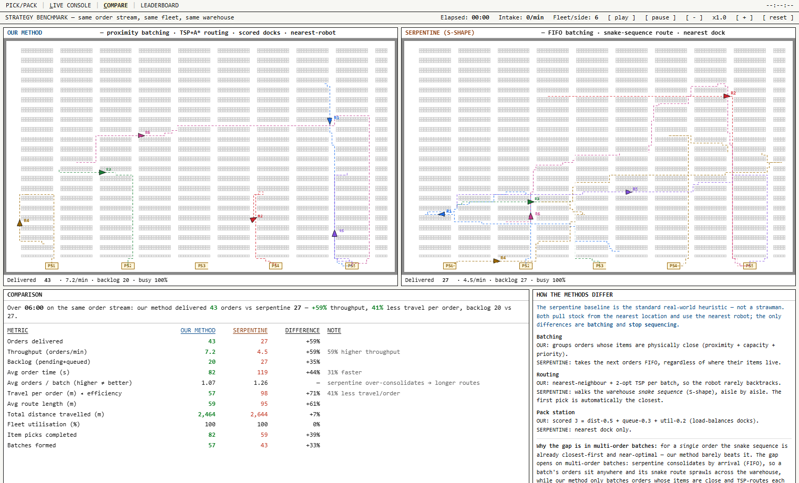
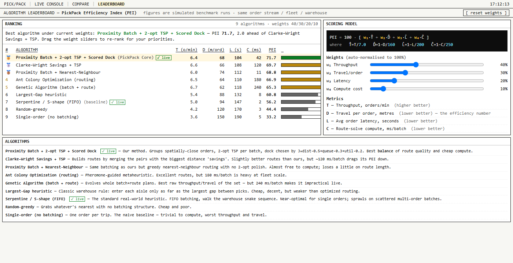

# PickPack — Autonomous Warehouse Execution System

A browser-based **digital twin** of an autonomous warehouse: a continuous stream of orders is
batched, allocated across multi-location inventory, routed with A\* + TSP, and executed by a fleet
of robots that deliver to intelligently-scored packing stations — all visualised in real time, with
a first-person view from any robot and a head-to-head benchmark against the standard industry
heuristic.

It runs entirely in a single browser tab. No framework, no build step, no backend.



---

## The idea

In a large warehouse the hard part isn't the robots — it's the *thinking* in front of them. Orders
arrive all day; the naïve approach treats each as its own errand (send a bot, grab one item, come
back), which is simple and wasteful. PickPack is the layer that sits above the floor and constantly
asks: *given everything that just came in, what's the smartest way to pick and pack all of it?*

The system continuously:

1. **Ingests orders** from a live stream (mock ERP/WMS feed).
2. **Batches** them by physical proximity, robot capacity, and priority — not one-at-a-time.
3. **Allocates** each item to the nearest in-stock location, **combining multiple locations** when a
   single one can't fill the quantity (the same SKU is stocked in several places).
4. **Routes** each batch with a near-optimal path that rarely backtracks.
5. **Executes** the batch on the nearest available robot, delivering to the **least-busy, nearest**
   packing station.
6. **Re-balances** forever as new orders arrive — the floor is self-balancing.

Everything is shown in a real-time 3D digital twin, and you can drop into any robot's first-person
camera to watch it work.

---

## What's included

The project is three self-contained pages, cross-linked in the top nav:

| Page | File | What it is |
|---|---|---|
| **Live Console** | `index.html` | The main operations cockpit — top-down map, isometric 3D view, forward camera, and live tables for the fleet, batches, orders, pack stations, and allocation decisions. |
| **Compare** | `compare.html` | A benchmark that runs **our method vs. the industry-standard serpentine (S-shape) heuristic** on the *identical* order stream, side by side, with a full metrics comparison. |
| **Leaderboard** | `leaderboard.html` | Ranks 10 pick/pack algorithms by a composite **PickPack Efficiency Index (PEI)**, with adjustable weights that re-rank live. |

---

## How it works

### 1. The warehouse
A `160 × 96` typed grid (**15,360 cells**): walls, shelves, aisles, and 5 packing stations
(`PS1`–`PS5`). Inventory is **realistically slotted** — ~1,650 SKUs, each living in only a few
specific slots placed by ABC velocity (fast movers near dispatch, slow movers in the back). Over
half of all SKUs are stocked in **2–3 separate locations**, sometimes at opposite ends of the
building.

### 2. Order intake → batching
Orders stream in continuously (rate adapts to backlog so the floor stays legible). A batch is seeded
by the highest-priority / oldest order, then grown with nearby orders up to capacity
(≤ 4 orders / ≤ 10 units). Grouping by **item proximity** keeps a batch's picks physically close.

### 3. Inventory allocation (multi-location)
For each line, the allocator finds every slot holding that SKU, sorts by distance, and takes greedily
from the nearest — **splitting a line across locations** when the nearest slot can't cover the
quantity (e.g. `13 × BOLT-M6 → 8 @ R14-B07-114 + 5 @ R14-B07-115`). The goal is *completeness* — pick
every item wherever it lives — not perfect optimality.

### 4. Route generation (A\* + TSP)
- **A\*** with a Manhattan heuristic and a **binary-heap** priority queue solves the shortest valid
  path between any two points; corner-to-corner across 15k cells solves in single-digit milliseconds.
- The batch's pick stops are ordered with **nearest-neighbour + 2-opt** (a TSP approximation) so the
  robot rarely backtracks, then the legs are stitched with A\*.

### 5. Pack-station selection
When a route is built, the destination dock is chosen by a scored objective:

```
J = α·distance + β·queue + γ·utilisation      (α=0.5, β=0.3, γ=0.2)
```

The lowest-scoring station wins, so work spreads across docks instead of piling onto the nearest one.
The live console shows every station's score for the batch currently being allocated.

### 6. Execution & the fleet
12 robots run concurrently. Each drives its route (movement smoothed with a Catmull-Rom spline),
pauses at each shelf to pick, delivers to its dock, and returns to idle. Robots track **battery** and
**auto-route to a station to charge** when low; one unit is shown offline for maintenance.

### 7. Visualisation
- **Top-down map** — the whole floor, every robot (coloured) with its live route and pick stops, dock
  queues, and shelf-activity heat. Click a shelf for details, or a robot to take its camera.
- **Isometric 3D** — a chase view of the selected robot with extruded racks.
- **Forward camera** — a raycast first-person view (one ray per screen column) from the selected robot.

---

## Benchmark: our method vs. serpentine



Both simulations get the **same order stream, same fleet, same warehouse**. The only differences are
**batching** (proximity vs. FIFO) and **stop sequencing** (2-opt TSP vs. the warehouse snake
sequence). Everything else — nearest-location allocation, nearest robot — is identical, so the
comparison is fair.

The serpentine (S-shape) baseline is the genuine real-world heuristic, not a strawman: it walks the
aisles in a fixed snake order, so for a **single** order its first pick is automatically the closest
and its route is near-optimal. The advantage of our method opens up on **multi-order batches**, where
FIFO batching lets a batch's items sit anywhere and the snake route sprawls across the warehouse,
while proximity batching + TSP keep each trip tight.

Typical result at a multi-order load: **~+50% throughput**, **~35–40% less travel per order**, and
**~30% faster order times**.

---

## Algorithm leaderboard



The leaderboard scores 10 algorithms on a single composite index:

```
PEI = 100 · [ w₁·T̂ + w₂·D̂ + w₃·L̂ + w₄·Ĉ ]

T̂ = T/7.0      (throughput, orders/min — higher better)
D̂ = 1 − D/160  (travel per order, m — lower better)
L̂ = 1 − L/200  (avg order latency, s — lower better)
Ĉ = 1 − C/250  (route-solve compute, ms/batch — lower better)
```

Default weights are `0.40 / 0.30 / 0.20 / 0.10`. The **weight sliders re-rank the board live** — crank
up "compute cost" and the cheap heuristics rise while brute-force metaheuristics (Genetic, ACO) sink.
The two strategies actually implemented here (PickPack Core, Serpentine) are marked **✓ live**; the
rest use realistic modelled figures.

> The input metrics are simulated benchmark figures; the PEI math is real and computed in the page.

---

## Tech stack

- **Vanilla JavaScript + HTML5 Canvas 2D** — no framework, no bundler, no dependencies.
- Three canvases per console: top-down map, isometric projection, and a raycast first-person view.
- **Python `http.server`** as a trivial static dev server.

The whole app is three `.html` files you can open directly or serve statically.

---

## Requirements & running it

**Requirements:** any modern browser (Chrome, Edge, Firefox). For local serving, Python 3 (optional —
you can also just open the files).

```bash
# clone
git clone https://github.com/ollielarkins/pickpack
cd pickpack

# serve (any static server works)
python -m http.server 5599

# then open:
#   http://localhost:5599/index.html        (live console)
#   http://localhost:5599/compare.html       (benchmark)
#   http://localhost:5599/leaderboard.html    (leaderboard)
```

Or simply double-click `index.html`.

### Controls (Live Console)
- **Click a robot** on the map → view its camera; **click a shelf** → inspect its contents.
- **Robot Camera Control** panel: select robot, `play` / `pause` / `step`, speed `− / +`.
- **Keyboard:** `space` = play/pause, `m/f/b/o/l/s` jump to Map/Fleet/Batches/Orders/Log/Settings,
  `c` = Compare.
- **Fast-forward (demos/screenshots):** append `?ff=SECONDS` to any page URL to deterministically
  simulate that many seconds before first render, e.g. `index.html?ff=150`.

---

## Project structure

```
pickpack/
├── index.html          # Live operations console (map, 3D, FPV, all tables)
├── compare.html        # Our method vs. serpentine benchmark
├── leaderboard.html    # PEI algorithm leaderboard (interactive weights)
├── screenshots/        # Images used in this README
└── README.md
```

---

## Roadmap / not yet built

- **Congestion & collision** — robots currently pass through each other; A\* has no traffic cost and
  there's no aisle yielding or the "congestion areas" heat overlay.
- **A real backend** — orders are mock-generated in-browser and state resets on reload; nothing is
  wired to a live ERP/WMS/inventory feed.
- **SLAs / deadlines**, live parameter tuning (batch size, fleet count, α/β/γ weights), and
  time-series analytics.

---

*Designed as an ops-console (raw industrial, monospace, information-dense). Built as a single-file
simulation to keep it dependency-free and instantly runnable.*
